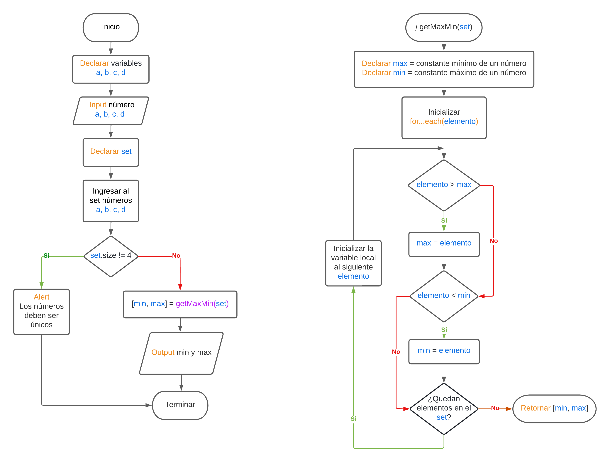

# Ejercicio 2

## Desarrolle un algoritmo que permita:

- Leer cuatro valores numéricos y almacenarlos en las variables A, B, C y D
  respectivamente.
- El algoritmo debe imprimir cual es el mayor valor y cual es el menor valor. Recuerde
  verificar que los cuatro valores introducidos por el teclado sean valores distintos.
- Crear un mensaje de alerta en caso que se detecte la introducción de valores iguales

Flowchart:

